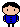

# Overview

Background Story: An unlucky kid was locked in the school, and he is trying to solve the problems in the rooms in order to get free. 

{Provide a description the game that you wrote. Describe how to play your game.}

{Describe your purpose for writing this software.}

{Provide a link to your YouTube demonstration.  It should be a 4-5 minute demo of the game being played and a walkthrough of the code.}

[Software Demo Video](http://youtube.link.goes.here)

# Development Environment

{Describe the tools that you used to develop the software}

{Describe the programming language that you used and any libraries.}

# Useful Websites

* [Pygame](https://www.pygame.org/docs/)
* [Visual Studio Code](https://code.visualstudio.com/)

# Future Work

{Make a list of things that you need to fix, improve, and add in the future.}
* Item 1
* Item 2
* Item 3
