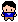

# Overview

Background Story: An unlucky kid was locked in the school, and he is trying to solve the problems in the rooms in order to get free.

Attach a pictrure for the math room
Room 1(Math room):

The room has question on the whiteboard. And the door next to whiteboard is locked by number password. He needs to find a way to solve the pasword. After he has solved the question then he needs to head to the Science Lab.

Attach a pic for the Science Lab
Room 2(Science Lab):

Science lab has a lot of chemical liquids in beaker. And referring to material notice on the notice board, mix colorful liquids by getting and using each color liquid in the sicence lab, and make correct color medicine, then the lock for teacher's table drawer will be unlocked. There is an answer. After player got science answer, head to Reading and Writing Center.

Attach a pic for the Reading and Writing Center
Room 3(Reading and Writing Center):

In the reading center, there is a Scrabble and play it, and the blank letter space with color. And the word by connecting the color letters will be the answer to open a shelf which has an answer.

Purpose:
The purpose of this game is to help kids around 6th grade to learn by playing game.

Below is the software demo video:
[Software Demo Video](http://youtube.link.goes.here)

# Development Environment

{Describe the tools that you used to develop the software}

{Describe the programming language that you used and any libraries.}

# Useful Websites

-  [Pygame](https://www.pygame.org/docs/)
-  [Visual Studio Code](https://code.visualstudio.com/)

# Future Work

{Make a list of things that you need to fix, improve, and add in the future.}

-  Item 1
-  Item 2
-  Item 3
