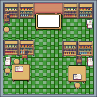
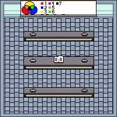

# Overview

Background Story: An unlucky kid was locked in the school, and he is trying to solve the problems in the rooms in order to get free.

## Room 1(Math room):

The room has question on the whiteboard. And the door next to whiteboard is locked. He needs to find a way to solve the math quiz in order to get acceses for the next room.

## Room 2(Reading and Writing Center):

In the reading center, there is a Scrabble and play it, and the blank letter space with color. And the word by connecting the color letters will be the answer to open a shelf which has an answer.

## Room 3(Science Lab):

Science lab needs you to figure out how to fix colors and find what's the color that is matching the quiz. After he has solved all the quiz for the color then he is able to access the exit door in order to get free.

Purpose:
The purpose of this game is to help children around 2nd grade to learn by playing game.

# Development Environment

- Python 3.9.6 64-bit
- Visual Studio Code
- Pygame 2.0

# Useful Websites

-  [Pygame](https://www.pygame.org/docs/)
-  [Visual Studio Code](https://code.visualstudio.com/)

# Contributors

- [Team Lead Aaron Jones](https://github.com/Aaronlongstocking97)
- [Quality Assurance Xing Gao](https://github.com/SolomonGao)
- [Project Manager Aoi Kuriki](https://github.com/A0i-Noel)
- [Graphic Designer Todd Wahlquist](https://github.com/Blazelighter)
- [Documentation Manager Kai Zhang](https://github.com/KaiTheOcean)